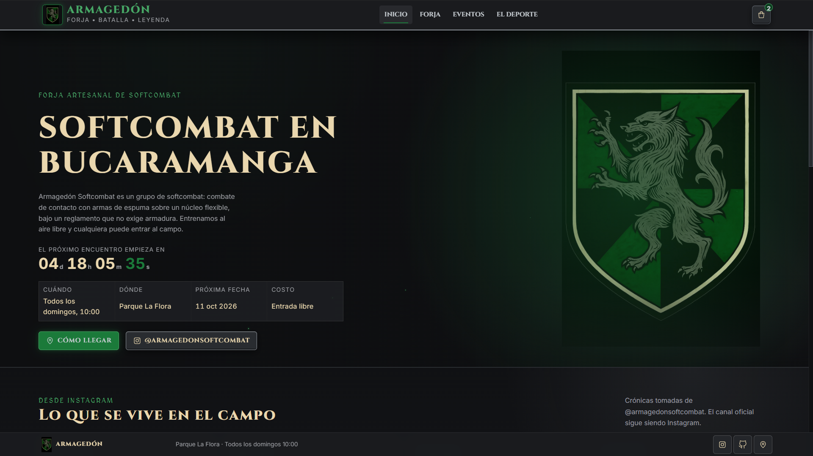
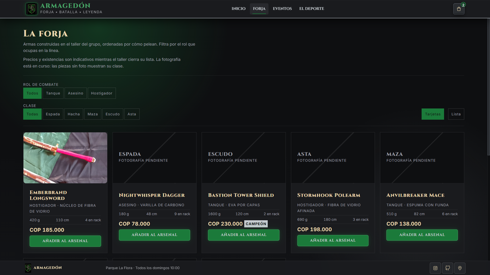
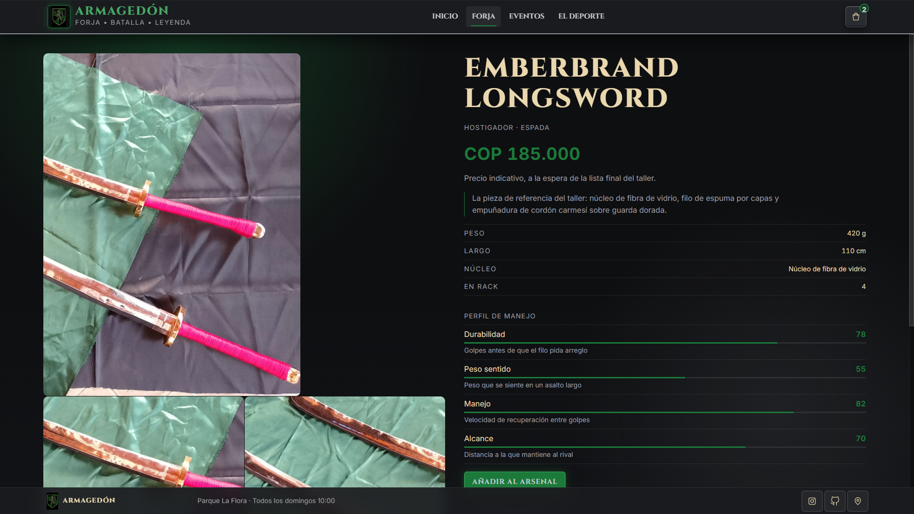
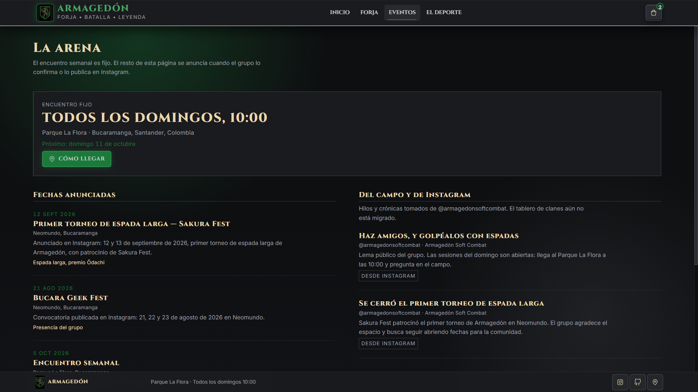
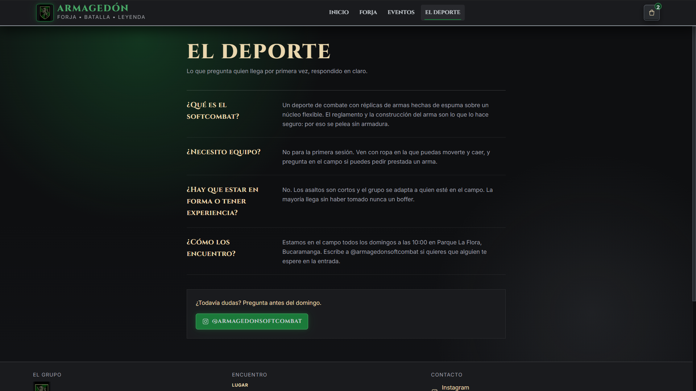

# StrikeSoft Hub

StrikeSoft Hub is the web home of **Armagedón Softcombat**, a softcombat group that meets every
Sunday at 10:00 in Parque La Flora, Bucaramanga, Santander, Colombia. The visitor-facing interface
is in Spanish. Copy lives as TypeScript modules under `src/app/core/copy/`, not in templates.

The first question the site answers is where and when to show up. From there it carries the
calendar, a workshop catalog, and public chronicles transcribed from
[@armagedonsoftcombat](https://www.instagram.com/armagedonsoftcombat/).

The visual system is the **Armagedón forge** language: stone canvas, iron frames, silver trim,
warm type, and a club-shield accent in `--color-main`. Rising particles on the home hero use
that same accent. Color tokens live only in `src/styles.css` and are named by role (`main`,
`canvas`, `panel`, `trim`, `text`) so the hex values can change later. Feature mapping is in
[docs/architecture_guidelines.md](docs/architecture_guidelines.md). Hover never moves an
element: only color, background, or border may change.

A local HTML/CSS/JS mockup may exist under `public/design_ref/` as a visual source. That folder is
gitignored and is not part of the shipped Angular app.

The application prefers [Supabase](https://supabase.com/) when the project is configured and
reachable. If the backend is offline, missing, or unconfigured, the same catalog, cart, and session
flows continue on LocalStorage without interrupting the visitor.

## Screenshots











## Features

- Spanish UI with copy files in `src/app/core/copy/`
- Home hero with the club shield, accent particles, and a live Sunday countdown in COT
- Instagram chronicles on the home page (Sakura Fest, Bucara Geek Fest, Sunday call)
- Armory with combat-role and weapon-class filters, a card/list toggle (`gridView` signal), a fixed CSS card grid, measured specs, and prices in Colombian pesos
- Weapon detail with workshop photography when it exists
- Arena with the standing Sunday fixture plus announced dates from the public Instagram
- Cart as a right-hand drawer, then an auth-guarded reservation flow
- Notifications themed to iron, green, and silver, centralized in `NotificationService`
- Progressive Web App manifest and production service worker

## Honesty of the content

The group, the venue, the weekly schedule, the Instagram account, the official bio, and the
workshop photography are real. Instagram items are transcribed captions and on-image text from the
public profile; they are not a live Instagram embed. Prices and stock counts are still indicative
and labeled as such. Pieces without a photograph show their class rather than a substitute image.
Confirmed facts live in `src/app/core/config/group.ts`.

## Stack

- Angular 22 standalone components, signals, lazy-loaded routes, and `PreloadAllModules` after first paint
- `es-CO` locale for dates
- Design tokens in `src/styles.css` (`html` root at 62.5% so `1rem` equals `10px`): `--color-main` accent, `--highlight` trim, canvas/panel ground
- Cinzel, MedievalSharp, and Inter
- Supabase Auth and Postgres as the primary backend
- LocalStorage as an automatic fallback and cache
- SweetAlert2 through `NotificationService`

## Getting started

1. Install Node.js 22 or later.
2. Copy `.env-template` to `.env`.
3. Optional: add `NG_APP_SUPABASE_URL` and `NG_APP_SUPABASE_ANON_KEY` from a dedicated Supabase
   project. Leave them empty to run entirely on the local fallback.
4. Install and start:

```bash
npm install
npm start
```

Open `http://localhost:4200/`. Auth (`/auth`) and profile (`/profile`) are not linked from the
header; open those URLs directly.

`npm start` and `npm run build` run `scripts/apply-env.mjs`, which writes
`src/environments/environment.secrets.ts` from `.env`.

On boot the app probes Supabase Auth health. If the probe succeeds, repositories read live tables
and cache the result. If it fails, seed data and user actions stay in LocalStorage. Returning
online does not require a reload; the next probe switches the write path back to Supabase for
authenticated sessions.

`.env` is gitignored. Do not add `docs/DESIGN.md`, `docs/PRODUCT.md`, or `docs/setup.md`. Those
notes belong in this README, `docs/design_guidelines.md`, and `docs/architecture_guidelines.md`.

## Supabase setup

Apply `supabase/migrations/20260912120000_init_strikesoft.sql` to a dedicated project. The migration
creates catalog, community, cart, and order tables with row-level security:

- Public read access for weapons, events, and clan posts
- Owner-only access for cart and orders

Use a publishable or legacy anon key in the browser. Never place a `service_role` key in this
repository.

## Scripts

| Command | Purpose |
| --- | --- |
| `npm start` | Sync env files and serve the app |
| `npm run build` | Production build |
| `npm test` | Unit tests (Vitest) |
| `npm run env:sync` | Refresh generated secrets from `.env` |
| `scripts/shoot.ps1` | Capture page screenshots with headless Chrome |

## Architecture

```text
src/app/
  core/
    config/     confirmed group facts
    copy/       Spanish UI strings, one file per surface
    data/       catalog, events, Instagram chronicles, first-Sunday steps
    models/     typed records
    repositories/  Supabase + LocalStorage
    services/   cart, auth, muster, notifications
  features/     home, armory, arena, lore, auth, checkout, profile
  shared/       accent particle field, weapon card, stats, loading
  layout/       topbar, cart drawer, compact/full footer, fixed-height shell
```

The layout shell is a viewport-high grid (`auto 1fr`). `html` and `body` do not scroll; `<main>`
uses `overflow-y: scroll` and holds the full footer. A compact contact bar stays fixed until the
visitor reaches the end of the content. Repositories skip a second network/local read when
already hydrated.

See [docs/architecture_guidelines.md](docs/architecture_guidelines.md) and
[docs/design_guidelines.md](docs/design_guidelines.md).

## Screenshots from the running app

`scripts/shoot.ps1` captures one PNG per public route into `public/screenshots/`. Use a fresh
Chrome profile (the script already does) so a stale service worker does not serve an old build.

## Author

Created by [Hugo Colmenares](https://github.com/HugoFernandoColmenares).
